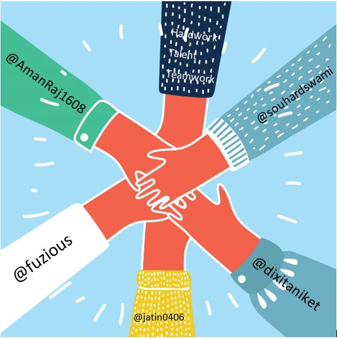

  
  
  
  
  

<h1 align="center">Actum</h1>

<b>Because Action speaks louder than Words</b>

> An app (Actum) that makes communication with the deaf and dumb smart by converting their hand gestures to text which can be understood by normal person.

### Motive

For actions to speak louder than words Actum has been designed to enhance the communication between normal and specially abled (deaf and dumb).

### Why Actum?

Actum is the complete solution to ease communication between normal and especially abled person viz. deaf and dumb. Using it anyone can easily recognize gestures produced by the deaf and dumb. Now speech will no more be a restriction to interact with someone. Using it the deaf and dumb can also easily interact with someone who don’t recognize their action, so that speech is no longer a restriction for them to express their feelings. Actum also has a chat app which the deaf and dumb can use to interact with others just by their gestures.

### Technologies

- Django
- Image Processing
- Image classfication using classifier
- Image classification using CNN classifier
- CNN classifier build using Tensorflow

### Modus Operandi

Actum has a ML script running in the Django backend which will detect the gestures performed by any deaf or dumb which can be then mapped to a particular action which will be unique to that gesture.Then this gesture is passed by the backend to frontend where the text is displayed.  

Actum detects hand gestures and map them to their meanings in the standard sign language. We used the ASL standard dataset provided by Kaggle and trained a CNN classifier on top of it. 

We used rmsprop as an optimizer, accuracy metrics and sparse categorical crossentropy as the loss function. 

We made chat application in Django. On front-end we are recording it using HTML and using JavaScript we saved it to back-end.

The next part of the project was to capture the frames present in the feed provided by either a pre-recorded video or live camera feed from some source ,The frame was then processed essentially was reduced to the dimensions of 28*28 pixels and converted to gray scale so we could obtain a single channel 28*28 image. 

(The dataset was single channel images of 28*28 pixels so we pre-processed the images from the feed to suit the model trained)

(Note: we actually fixed the region of the frame in the feed so we could detect the gestures present in that frame, However to extend the functionality for the entire frame we could use a cascade classifier to extract the information of the hand from the background)

In back-end using Python we have now converted it to Matrix. Now we trained model which would in turn provide us with the prediction of the image. We pass this processed information in form of txt file which we will pass to front-end to mapped image according to information. The prediction is then mapped to the class category and displayed to the user.

### Contributors
 |  |  |  |  |
---|---|---|---|---|
[Aman Raj](https://github.com/amanraj1608) | [Aniket Dixit](https://github.com/dixitaniket) | [Arpit Srivastava](http://github.com/fuzious) |  [Jatin Singh Chauhan](https://github.com/jatin0406) | [Souhard Swami](http://github.com/souhardswami) |  

### References

- [Model Retraining and Transfer Learning](https://www.tensorflow.org/tutorials/image_retraining)
